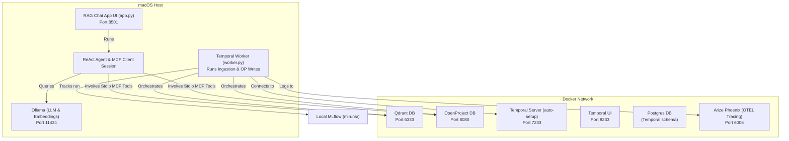

# RagForge: Custom MCP RAG & Project Management Agent

RagForge is a local, production-grade Retrieval-Augmented Generation (RAG) chat application and project management assistant. It parses complex documents, embeds them, indexes them into a vector database, and operates in a ReAct loop to query documents and automate project management tasks (creating work packages, updating status, adding comments).

The system integrates custom stdio Model Context Protocol (MCP) servers with a modular ingestion pipeline orchestrated by **Temporal.ai**, tracked via **MLflow**, and traced using **OpenTelemetry** / **Arize Phoenix**.

---

## 🧭 Architecture

The application is deployed in a hybrid local configuration: database, orchestration, and tracing servers run in containerized environments (Docker Compose), while GPU-intensive models (Ollama), python workflows, workers, and UI interfaces run on the macOS host for direct metal acceleration.



---

## 🛠️ Tech Stack & Dependencies

- **Orchestration**: [Temporal.ai](https://temporal.ai)
- **Vector Database**: [Qdrant DB](https://qdrant.tech)
- **Project Management**: [OpenProject](https://www.openproject.org) (API v3)
- **Inference & Embeddings**: [Ollama](https://ollama.com) (`gemma4:e4b` + `nomic-embed-text`)
- **Telemetry & Tracing**: [Arize Phoenix](https://phoenix.arize.com) (OTEL Collector) + [MLflow](https://mlflow.org)
- **UI Framework**: [Streamlit](https://streamlit.io)
- **Environment Management**: [uv](https://github.com/astral-sh/uv)

---

## 📁 Directory Structure

```text
RAGFORGE/
├── deploy/                    # Deployment scripts & Docker configs
│   ├── docker-compose.yml     # Postgres, Temporal, Qdrant, OpenProject, Phoenix Containers
│   └── manage_services.sh     # Orchestrates starting, stopping, and status checks of services
│
├── pyproject.toml             # Python dependency metadata (managed by uv)
├── config.yaml                # General service and session configurations
├── .env                       # Local environment configurations
├── app.py                     # Streamlit frontend & ReAct client loop
│
├── notebooks/                 # Study & Exploration Playgrounds
│   ├── qdrant/                # Basic CRUD & Chat with Vector DB notebooks
│   ├── mlflow/                # MLflow Experiment tracking notebook
│   ├── phoenix/               # Arize Phoenix Tracing & Observability notebook
│   ├── otel/                  # OpenTelemetry Manual Instrumentation notebook
│   ├── postgres/              # PostgreSQL Database Exploration notebook
│   ├── openproject/           # OpenProject REST API Exploration notebook
│   └── temporal/              # Temporal Client Exploration notebook
│
├── servers/                   # Custom stdio MCP Servers
│   ├── openproject_mcp.py     # OpenProject APIv3 integration server
│   └── qdrant_mcp.py          # Qdrant + Ollama vector indexing server
│
├── src/                       # Core RagForge source package
│   └── ragforge/
│       ├── loader/            # Specialized parsers (PDF, Excel, PPTX, Images)
│       ├── chunking/          # Context-aware text splitters
│       ├── session_store.py   # JSON and Postgres session history store backends
│       ├── config.py          # Config-driven connection settings
│       ├── embeddings/        # Embedding abstractions (Ollama client)
│       ├── index/             # Qdrant collection operations
│       ├── workflows/         # Temporal Workflow & Activity declarations
│       │   ├── ingestion.py   # Dir scan, parse, index, and MLflow logging workflow
│       │   └── openproject.py # OpenProject creates, updates, and comment activities
│       ├── agents/            # Modular LangGraph Agents (e.g. agents/rag/)
│       ├── worker.py          # Temporal Worker launcher
│       └── utils/             # OTEL tracing hooks & decorators
│
└── tests/                     # Pipeline component and workflow test suite
```

---

## 💾 Session & Memory Management

To support resuming conversation states without exceeding the LLM context limits, RagForge employs a hybrid memory design:

1. **Session Store Abstraction**:
   * Sessions are managed via the [BaseSessionStore](file:///Users/sunnyraj/code_files/git_repos/RagForge/src/ragforge/session_store.py#L9) interface.
   * Backends are configured via `session_store.type` in [config.yaml](file:///Users/sunnyraj/code_files/git_repos/RagForge/config.yaml):
     * `"json"`: Serializes message history locally under `data/sessions/`.
     * `"postgres"`: Persists history inside a relational PostgreSQL table (`chat_sessions`).
2. **Context Window Strategy**:
   * Passes a system prompt alongside a configurable rolling window of recent conversation turns (defaults to last `3` turns / `6` messages) to avoid model context token limitations.
3. **Long-Term Memory Retrieval**:
   * Every completed chat conversation turn (user prompt + assistant response) is embedded and indexed in Qdrant under a specialized `"chat-history-collection"`.
   * The reasoning agent has access to a `search_chat_history` tool, letting it semantic-search past conversation histories across sessions.

---

## 📓 Service Playgrounds (Jupyter Notebooks)

A collection of interactive notebooks is available inside the `notebooks/` directory to study, verify, and experiment with the integrated stack components:

* **Qdrant Vector DB**:
  * [01_basic_crud.ipynb](file:///Users/sunnyraj/code_files/git_repos/RagForge/notebooks/qdrant/01_basic_crud.ipynb) – Creating collections, vector embeddings generation, and session-filtered queries.
  * [02_chat_with_db.ipynb](file:///Users/sunnyraj/code_files/git_repos/RagForge/notebooks/qdrant/02_chat_with_db.ipynb) – Simple retrieval-augmented generation (RAG) agent flow.
* **MLflow**:
  * [explore_mlflow.ipynb](file:///Users/sunnyraj/code_files/git_repos/RagForge/notebooks/mlflow/explore_mlflow.ipynb) – Logging parameters, runs, metrics, and querying tracked runs.
* **Arize Phoenix / OpenTelemetry**:
  * [observability_traces.ipynb](file:///Users/sunnyraj/code_files/git_repos/RagForge/notebooks/phoenix/observability_traces.ipynb) – Instrumenting and viewing execution spans inside the Phoenix dashboard.
  * [otel_instrumentation.ipynb](file:///Users/sunnyraj/code_files/git_repos/RagForge/notebooks/otel/otel_instrumentation.ipynb) – Manual OTel tracing, event logs, and exception telemetry.
* **PostgreSQL**:
  * [postgres_playground.ipynb](file:///Users/sunnyraj/code_files/git_repos/RagForge/notebooks/postgres/postgres_playground.ipynb) – SQL playground executing queries and JSONB operations.
* **OpenProject REST API**:
  * [openproject_api.ipynb](file:///Users/sunnyraj/code_files/git_repos/RagForge/notebooks/openproject/openproject_api.ipynb) – Querying, creating work packages, and commenting via endpoints.
* **Temporal Client**:
  * [temporal_playground.ipynb](file:///Users/sunnyraj/code_files/git_repos/RagForge/notebooks/temporal/temporal_playground.ipynb) – Querying workflow status, and programmatic workflow initiation.

All playgrounds resolve connection endpoints solely through [src/ragforge/config.py](file:///Users/sunnyraj/code_files/git_repos/RagForge/src/ragforge/config.py).

---

## 🚀 Getting Started

### 1. Prerequisites

- Install **Docker** & **Docker Compose**.
- Install **Ollama** on your macOS host and pull the required models:
  ```bash
  ollama pull gemma4:e4b
  ollama pull nomic-embed-text
  ```
- Install `uv` for python dependencies:
  ```bash
  brew install uv
  ```

### 2. Setup Infrastructure

Orchestrate the startup of all database, tracing, and workflow containers:

```bash
chmod +x deploy/manage_services.sh
./deploy/manage_services.sh start
```

Verify the status of the services at any time with:

```bash
./deploy/manage_services.sh status
```

### 3. Seed OpenProject API Token

OpenProject relies on an API token for authentication. You can programmatically seed the API Token `my_custom_api_key_123456789` for the `admin` user by executing:

```bash
docker exec openproject-app bundle exec rails runner "
admin = User.find_by(login: 'admin')
Token::API.where(user: admin).destroy_all
t = Token::API.new(user: admin)
t.value = t.hash_function('my_custom_api_key_123456789')
t.save!
puts 'Seeded token successfully.'
"
```

### 4. Install Dependencies

Configure virtual environment and sync python packages:

```bash
uv venv
source .venv/bin/activate
uv sync
```

### 5. Environment Config (`.env`)

Create a `.env` file in the root directory:

```env
OPENPROJECT_URL=http://localhost:8080
OPENPROJECT_API_KEY=my_custom_api_key_123456789
QDRANT_URL=http://localhost:6333
OLLAMA_URL=http://localhost:11434
TEMPORAL_URL=localhost:7233
PHOENIX_COLLECTOR_URL=http://localhost:6006/v1/traces
MLFLOW_ALLOW_FILE_STORE=true
```

---

## ⚡ Running the Services

Launch these processes in separate terminal sessions:

### 1. Run the Temporal Worker

```bash
PYTHONPATH=. uv run python src/ragforge/worker.py
```

### 2. Start the Streamlit App

```bash
uv run streamlit run app.py
```

---

## 📊 Viewing Metrics & Telemetry

Open the following dashboards in your browser:

- **Streamlit Web UI**: [http://localhost:8501](http://localhost:8501)
- **Arize Phoenix UI (Traces)**: [http://localhost:6006](http://localhost:6006)
- **Temporal Web Dashboard**: [http://localhost:8233](http://localhost:8233)
- **OpenProject Web Workspace**: [http://localhost:8080](http://localhost:8080) (Log in with `admin`/`admin` on first launch)
- **MLflow Tracking UI**:
  Launch the tracking server targeting the configured SQLite database:
  ```bash
  uv run mlflow ui --backend-store-uri sqlite:///data/mlflow.db --port 5000
  ```
  Then open [http://localhost:5000](http://localhost:5000).

---

## 🧪 Testing

The repository contains a pytest integration suite verifying the loaders, chunkers, session store, vector insertion, and workflow executions:

```bash
PYTHONPATH=. uv run python -m pytest
```
