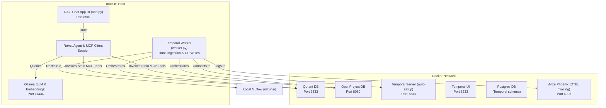

# RagForge: Custom MCP RAG & Project Management Agent

RagForge is a local, production-grade Retrieval-Augmented Generation (RAG) chat application and project management assistant. It parses complex documents, embeds them, indexes them into a vector database, and operates in a ReAct loop to query documents and automate project management tasks (creating work packages, updating status, adding comments).

The system integrates custom stdio Model Context Protocol (MCP) servers with a modular ingestion pipeline orchestrated by **Temporal.ai**, tracked via **MLflow**, and traced using **OpenTelemetry** / **Arize Phoenix**.

---

## 🧭 Architecture

The application is deployed in a hybrid local configuration: database, orchestration, and tracing servers run in containerized environments (Docker Compose), while GPU-intensive models (Ollama), python workflows, workers, and UI interfaces run on the macOS host for direct metal acceleration.



---

## 🛠️ Tech Stack & Dependencies

- **Orchestration**: [Temporal.ai](https://temporal.ai)
- **Vector Database**: [Qdrant DB](https://qdrant.tech)
- **Project Management**: [OpenProject](https://www.openproject.org) (API v3)
- **Inference & Embeddings**: [Ollama](https://ollama.com) (`gemma4:e4b` + `nomic-embed-text`)
- **Telemetry & Tracing**: [Arize Phoenix](https://phoenix.arize.com) (OTEL Collector) + [MLflow](https://mlflow.org)
- **UI Framework**: [Streamlit](https://streamlit.io)
- **Environment Management**: [uv](https://github.com/astral-sh/uv)

---

## 📁 Directory Structure

```text
RAGFORGE/
├── docker-compose.yml         # Postgres, Temporal, Qdrant, OpenProject, Phoenix Containers
├── pyproject.toml             # Python dependency metadata (managed by uv)
├── chunking_config.yaml       # Config-driven chunking strategy definitions
├── .env                       # Local environment configurations
├── app.py                     # Streamlit frontend & ReAct client loop
│
├── servers/                   # Custom stdio MCP Servers
│   ├── openproject_mcp.py     # OpenProject APIv3 integration server
│   └── qdrant_mcp.py          # Qdrant + Ollama vector indexing server
│
├── src/                       # Core RagForge source package
│   └── ragforge/
│       ├── loader/            # Specialized parsers (PDF, Excel, PPTX, Images)
│       ├── chunking/          # Context-aware text splitters
│       ├── embeddings/        # Embedding abstractions (Ollama client)
│       ├── index/             # Qdrant collection operations
│       ├── workflows/         # Temporal Workflow & Activity declarations
│       │   ├── ingestion.py   # Dir scan, parse, index, and MLflow logging workflow
│       │   └── openproject.py # OpenProject creates, updates, and comment activities
│       ├── worker.py          # Temporal Worker launcher
│       └── utils/             # OTEL tracing hooks & decorators
│
└── tests/                     # Pipeline component and workflow test suite
```

---

## 🚀 Getting Started

### 1. Prerequisites
- Install **Docker** & **Docker Compose**.
- Install **Ollama** on your macOS host and pull the required models:
  ```bash
  ollama pull gemma4:e4b
  ollama pull nomic-embed-text
  ```
- Install `uv` for python dependencies:
  ```bash
  brew install uv
  ```

### 2. Setup Infrastructure
Launch the Docker Compose services:
```bash
docker compose up -d
```
Verify that all containers (`postgresql`, `qdrant-db`, `openproject-app`, `arize-phoenix`, `temporal-server`, `temporal-ui`) are running successfully using `docker ps`.

### 3. Seed OpenProject API Token
OpenProject relies on an API token for authentication. You can programmatically seed the API Token `my_custom_api_key_123456789` for the `admin` user by executing:
```bash
docker exec openproject-app bundle exec rails runner "
admin = User.find_by(login: 'admin')
Token::API.where(user: admin).destroy_all
t = Token::API.new(user: admin)
t.value = t.hash_function('my_custom_api_key_123456789')
t.save!
puts 'Seeded token successfully.'
"
```

### 4. Install Dependencies
Configure virtual environment and sync python packages:
```bash
uv venv
source .venv/bin/activate
uv pip install -e .
```

### 5. Environment Config (`.env`)
Create a `.env` file in the root directory:
```env
OPENPROJECT_URL=http://localhost:8080
OPENPROJECT_API_KEY=my_custom_api_key_123456789
QDRANT_URL=http://localhost:6333
OLLAMA_URL=http://localhost:11434
TEMPORAL_URL=localhost:7233
PHOENIX_COLLECTOR_URL=http://localhost:6006/v1/traces
```

---

## ⚡ Running the Services

Launch these processes in separate terminal sessions:

### 1. Run the Temporal Worker
```bash
PYTHONPATH=. uv run python src/ragforge/worker.py
```

### 2. Start the Streamlit App
```bash
uv run streamlit run app.py
```

---

## 📊 Viewing Metrics & Telemetry

Open the following dashboards in your browser:
- **Streamlit Web UI**: [http://localhost:8501](http://localhost:8501)
- **Arize Phoenix UI (Traces)**: [http://localhost:6006](http://localhost:6006)
- **Temporal Web Dashboard**: [http://localhost:8233](http://localhost:8233)
- **OpenProject Web Workspace**: [http://localhost:8080](http://localhost:8080) (Log in with `admin`/`admin` on first launch)
- **MLflow Tracking UI**:
  Launch the server locally:
  ```bash
  uv run mlflow ui --port 5000
  ```
  Then open [http://localhost:5000](http://localhost:5000).

---

## 🧪 Testing

The repository contains a pytest integration suite verifying the loaders, chunkers, vector insertion, and workflow executions:
```bash
PYTHONPATH=. uv run pytest
```